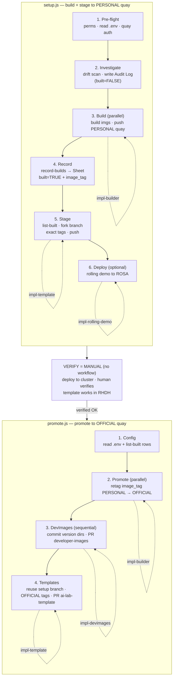

# ai-template-updater

Agentic tool that detects version drift in RHDH AI software templates, builds updated container images, and creates PRs to upstream repos. Runs as a Claude Code workflow with specialized subagents.

## What it does

Keeps [ai-lab-template](https://github.com/redhat-ai-dev/ai-lab-template) and [developer-images](https://github.com/redhat-ai-dev/developer-images) in sync with upstream model server releases (vLLM, llama.cpp, whisper.cpp) and HuggingFace model updates (Granite, Mistral, DETR, etc).

### Pipeline

```
Phase 1: Pre-flight     Load .env config, verify quay auth
Phase 2: Investigate    Check upstream for new versions, write the Audit Log to Google Sheets
Phase 3: Build          Build container images, push to personal quay
Phase 4: Record         Write each pushed image tag back to the Sheet (built=TRUE + image_tag)
Phase 5: Stage          Read built rows from the Sheet, set template tags, push a fork branch
Phase 6: Deploy         Deploy rolling demo to ROSA (optional)
Phase 7: Verify         Human tests staged templates on ROSA cluster (human-in-the-loop)
Phase 8: Promote        Retag images to official quay, create PRs to upstream repos
```

**The Google Sheet is the source of truth after Investigate.** The build phase records
exact pushed tags to the Sheet; Stage/Deploy/Promote read them back — no image tag is
ever reconstructed by hand (this prevents tag mismatches like vLLM's `v` prefix). There
is **no approval gate**: every detected update is built, every built image is staged/promoted.

Entry points:
- **`/setup`** — Pre-flight → Investigate → Build → Record → Stage → Deploy
- **`/stage-demo`** — Pre-flight → Stage → Deploy (skips Investigate+Build; reads already-built rows from the Sheet)
- **`/promote`** — Promote (after human verification)

### Diagram



## Prerequisites

> **Full stack reference:** [docs/required-stack.md](docs/required-stack.md) — every CLI,
> library, plugin, skill, auth, and repo, grouped by layer and by which phase needs it.

### CLI tools

| Tool | Install | Purpose |
|------|---------|---------|
| [Claude Code](https://docs.anthropic.com/en/docs/claude-code) | `npm install -g @anthropic-ai/claude-code` | Agent orchestration, workflow runner |
| [podman](https://podman.io/) | `sudo dnf install podman` (Fedora) / [install guide](https://podman.io/docs/installation) | Container image builds and pushes |
| [skopeo](https://github.com/containers/skopeo) | `sudo dnf install skopeo` (Fedora) / [install guide](https://github.com/containers/skopeo/blob/main/install.md) | Image inspection and tag listing |
| [gh](https://cli.github.com/) | `sudo dnf install gh` (Fedora) / [install guide](https://github.com/cli/cli#installation) | GitHub PR creation |
| Python 3.11+ | `sudo dnf install python3.11` (Fedora) / [python.org](https://www.python.org/downloads/) | CLI tool runtime |

### Authentication

| Service | How to authenticate | Used for |
|---------|-------------------|----------|
| **quay.io** | `podman login quay.io` — [docs](https://docs.quay.io/guides/login.html) | Push/pull container images |
| **GitHub** | `gh auth login` — [docs](https://cli.github.com/manual/gh_auth_login) | Create PRs, push to forks |
| **Google Sheets** | Installed via `gws` plugin below. Run `gws auth` to authenticate — [setup guide](https://github.com/WadeWarren/gws-claude-plugin) | Read template list, write the Version Status sheet / Audit Log |

### Claude Code plugins

Install via `claude plugins add` in Claude Code:

| Plugin | Install command | Purpose |
|--------|----------------|---------|
| `superpowers` | `claude plugins add superpowers@anthropics/claude-plugins-official` | Workflow orchestration, brainstorming, planning |
| `gws` | `claude plugins add gws@WadeWarren/gws-claude-plugin` | Google Workspace CLI (Sheets read/write). Also installs the `gws` CLI tool |
| `caveman` | `claude plugins add caveman@JuliusBrussee/caveman` | Terse subagent output (token savings) |
| `i-have-adhd` | `claude plugins add i-have-adhd@ayghri/i-have-adhd` | ADHD-friendly output formatting |

### Repos (local forks)

Fork and clone these repos locally, then set paths in `.env`:

| Repo | Clone | Purpose |
|------|-------|---------|
| [redhat-ai-dev/developer-images](https://github.com/redhat-ai-dev/developer-images) | `gh repo fork redhat-ai-dev/developer-images --clone` | Container build sources (Containerfiles, config.env) |
| [redhat-ai-dev/ai-lab-template](https://github.com/redhat-ai-dev/ai-lab-template) | `gh repo fork redhat-ai-dev/ai-lab-template --clone` | RHDH software templates (env files, generation scripts) |
| [redhat-ai-dev/ai-rolling-demo-gitops](https://github.com/redhat-ai-dev/ai-rolling-demo-gitops) (optional) | `gh repo fork redhat-ai-dev/ai-rolling-demo-gitops --clone` | ROSA cluster deployment for testing |

Each fork needs push access under your GitHub account.

## Setup

1. Clone this repo and install the CLI:

```bash
pip install -e .
```

2. Copy `.env.example` to `.env` and fill in values:

```bash
cp .env.example .env
```

Required values:
```
DEVELOPER_IMAGES_PATH=/absolute/path/to/developer-images
AI_LAB_TEMPLATE_PATH=/absolute/path/to/ai-lab-template
QUAY_PERSONAL_NS=your-quay-username
QUAY_OFFICIAL_NS=redhat-ai-dev
FORK_OWNER=your-github-username
```

Optional:
```
ROLLING_DEMO_GITOPS_PATH=/absolute/path/to/ai-rolling-demo-gitops
CLUSTER_API=https://api.rosa-xxx.openshiftapps.com:6443
CLUSTER_TOKEN=sha256:xxx
```

3. Configure Claude Code permissions:

```bash
agentic-template-ops configure
```

This generates `.claude/settings.local.json` with read access to the external repos.

4. Authenticate:

```bash
podman login quay.io
gh auth login
```

## Usage

Open Claude Code in this repo and run:

```
/setup       # pre-flight → investigate → build → record → stage → deploy
/stage-demo  # stage + deploy only (reads already-built rows from the Sheet)
/promote     # retag to official quay, create upstream PRs
```

Typical flow:

1. `/setup` -- pre-flight, investigate drift, build images, push to personal quay, record tags to the Sheet, stage templates on a fork branch, deploy rolling demo
2. **Verify** (human-in-the-loop) -- register output URL in RHDH, test staged templates on ROSA cluster
3. `/promote` -- retag images to official quay, create PRs to developer-images and ai-lab-template

Use `/stage-demo` to re-stage/redeploy without rebuilding (it reads the built rows the Sheet already holds).

### CLI (individual phases)

The `agentic-template-ops` CLI can run phases individually. `setup`, `promote`, and `run` spawn Claude subagents and require an active Claude Code environment.

```bash
agentic-template-ops configure       # Generate settings.local.json from .env
agentic-template-ops investigate     # Check for updates, write Audit Log (no agents)
agentic-template-ops record-builds --results '<json>'  # Mark rows built + store image_tag
agentic-template-ops list-built      # Print newest run's built rows as JSON
agentic-template-ops setup           # Build + stage (spawns agents)
agentic-template-ops promote         # Promote to production (spawns agents)
agentic-template-ops run             # Full pipeline
```

`record-builds` and `list-built` are the Sheet-as-source-of-truth primitives the
workflows use between Build and Stage. Add `--dry-run` to preview without side effects.

## Architecture

### Subagent-driven design

This tool uses Claude Code's [dynamic workflows](https://docs.anthropic.com/en/docs/claude-code) to orchestrate specialized subagents. Each workflow script (`.claude/workflows/*.js`) is a deterministic control-flow layer that spawns agents, deduplicates work, and gates phases on success/failure. Agents do the actual work — reading files, running shell commands, editing code.

**Why subagents instead of one big prompt?**
- Parallel execution: independent image builds run concurrently (e.g. 4 builds at once)
- Isolation: each agent gets a focused task with minimal context, reducing errors
- Specialization: agent definitions (`.claude/agents/*.md`) contain domain-specific build patterns, file layouts, and PR formats that would bloat a single prompt
- Resumability: workflow scripts can resume from cached agent results after interruption

### Models

| Component | Model | Why |
|-----------|-------|-----|
| Workflow orchestrator | Inherited from session (Opus/Sonnet) | Controls flow, spawns agents |
| `impl-builder` | `claude-sonnet-5[1m]` | Fast, cheap. Mechanical: copy dir, edit version, podman build |
| `impl-template` | `claude-sonnet-5[1m]` | Edits env files, runs generation scripts |
| `impl-devimages` | `claude-sonnet-5[1m]` | Git operations, PR creation |
| `impl-rolling-demo` | `claude-sonnet-5[1m]` | Cluster deployment |

Subagents use Sonnet for cost efficiency. Build/template tasks are well-defined and don't need Opus-level reasoning. The orchestrator (workflow script) handles all decision logic in plain JavaScript.

> Pin the **exact** model id in each `.claude/agents/impl-*.md` frontmatter — the
> `sonnet` alias can resolve to a base id your Vertex deployment doesn't serve. After
> editing frontmatter, restart the Claude Code session so definitions reload. See CLAUDE.md.

### Workflow structure

```
/setup workflow
  Pre-flight agent       Read .env, verify quay auth
  Quay auth agent        podman login --get-login
  Investigate agent      Run drift scanner, write Audit Log to the Sheet (built=FALSE)
  [JS dedup]             Deduplicate servers/models (zero tokens)
  Build agents (parallel) One per unique server/model, all run concurrently
  Record agent           record-builds → Sheet, then list-built → built rows
  Stage agent            Set template tags to the exact image_tag, push fork branch
  Deploy agent           (optional) rolling demo to ROSA

/stage-demo workflow
  Pre-flight agent       Read .env
  Read agent             list-built → built rows from the Sheet (no hardcoded list)
  Stage agent + Deploy agent   Same as /setup's last two phases

/promote workflow
  Config agent           Read .env + list-built rows (built images, with image_tag)
  [JS dedup]             Deduplicate
  Promote agents (parallel)  Retag image_tag from personal to official quay
  DevImages agents (sequential)  One PR per server to developer-images (shared git tree)
  Template agent         Update templates to official tags, create upstream PR
```

Brackets `[JS dedup]` = plain JavaScript in the workflow script, no agent spawned. Deduplication, filtering, and control flow run at zero token cost.

### Subagent definitions

Defined in `.claude/agents/*.md` with frontmatter (name, tools, model) and markdown body (build patterns, file locations, PR formats).

| Agent | Tools | Role | Used in |
|-------|-------|------|---------|
| `impl-builder` | Bash, Read, Edit, Write | Build container images (push to personal quay) / retag to official quay | setup, promote |
| `impl-template` | Bash, Read, Edit, Write | Update ai-lab-template env files (exact `image_tag`), regenerate templates | setup, stage-demo, promote |
| `impl-devimages` | Bash, Read, Edit, Write | Commit version dirs to developer-images, create PRs | promote |
| `impl-rolling-demo` | Bash, Read, Edit, Write | Deploy staged templates to ROSA cluster | setup, stage-demo |

Each agent definition contains server-specific build patterns (e.g. how vLLM requirements differ from llamacpp), CI skip lists, PR formats, and env file conventions. This domain knowledge stays in the agent definition and is loaded only when that agent runs.

### Model servers tracked

| Server | Upstream source | Image |
|--------|----------------|-------|
| vLLM | GitHub releases | `vllm-openai-ubi9` |
| llama.cpp | PyPI | `llamacpp_python` |
| whisper.cpp | GitHub releases | `whispercpp` |
| Object Detection | quay tags | `object_detection_python` |

### Models tracked

| Model | Source | Templates |
|-------|--------|-----------|
| granite-3.x-8b-instruct | HuggingFace | chatbot, rag |
| mistral-7b-instruct-v0.2 | HuggingFace | codegen |
| whisper-small | HuggingFace | audio-to-text |
| detr-resnet-101 | HuggingFace | object-detection |
| granite-7b-lab | HuggingFace | chatbot-quarkus |

### Google Sheets

A shared Google Sheet is the source of truth. Two tabs:
- **Template List** — input: which templates to monitor
- **Version Status** — output, written by `report.py`. Sections: **Model Servers**,
  **Models (HuggingFace)**, and **Audit Log** (run history).

The **Audit Log** section is the machine-readable contract. Each run is a summary row
`▶ RUN <timestamp>` followed by one item row per detected update:
```
template, component, server_type, current_version, latest_version,
source_url, notes, built, image_tag
```
- `investigate` writes rows with `built=FALSE` / empty `image_tag`.
- `record-builds` flips `built=TRUE` and stores the exact pushed `image_tag` after a build.
- `list-built` returns the newest run's `built==TRUE` rows — the staging/promote work-list.

Newest run on top; history capped at 20 runs. No approval column — detection ⇒ build ⇒
stage/promote flows automatically.

## Project structure

```
agentic_template_ops/
  cli.py                    # Click CLI (investigate, record-builds, list-built, setup, promote, run, configure)
  config.py                 # Server configs, data classes, .env parsing, Audit Log schema
  gws_client.py             # Google Sheets via gws CLI (read/write Audit Log, record/read build state)
  report.py                 # Writes VERSION_STATUS.md + the "Version Status" sheet
  agents/
    drift_scanner.py        # Orchestrates version checks
  server_agents/
    vllm_agent.py           # vLLM version checker
    llamacpp_agent.py        # llama.cpp version checker
    whispercpp_agent.py     # whisper.cpp version checker
    object_detection_agent.py
  model_agents/
    hf_model_agent.py       # HuggingFace model checker

.claude/
  agents/                   # Subagent definitions
    impl-builder.md
    impl-template.md
    impl-devimages.md
    impl-rolling-demo.md
  workflows/                # Claude Code workflow scripts
    setup.js                # pre-flight → investigate → build → record → stage → deploy
    stage-demo.js           # stage + deploy only (reads built rows from the Sheet)
    promote.js              # promote to official quay + upstream PRs

CLAUDE.md                   # Operational guide for agents (source of truth, gotchas)
```
